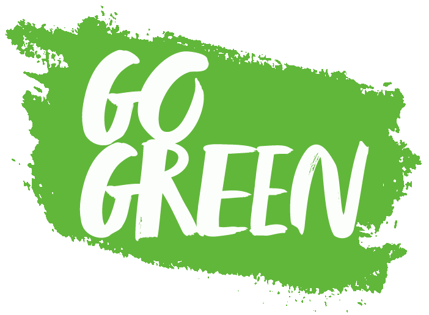
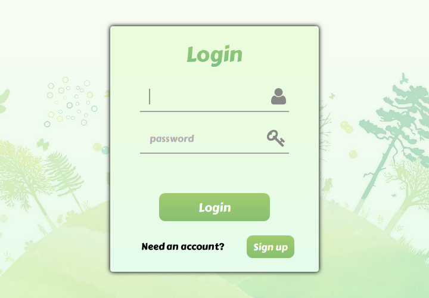
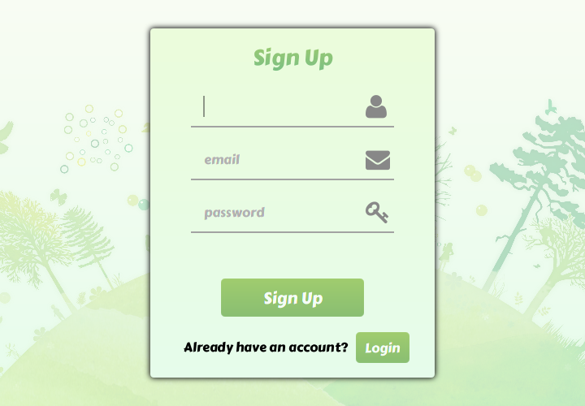
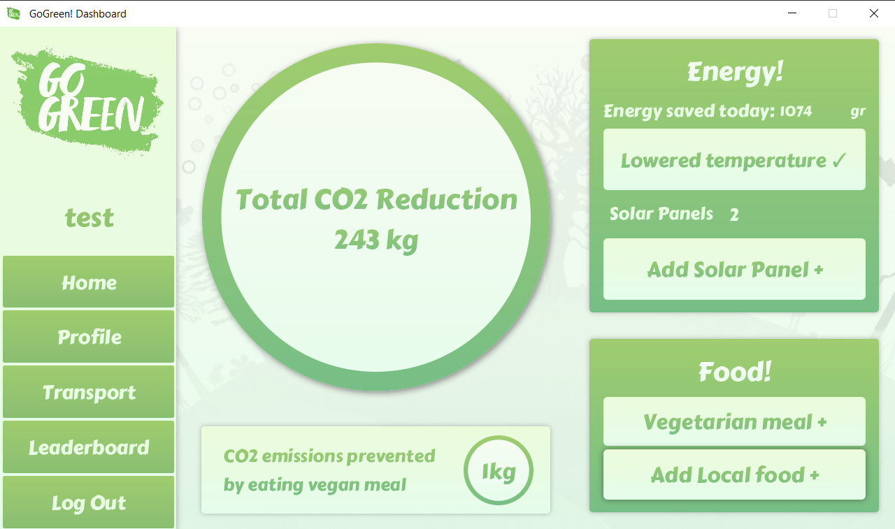
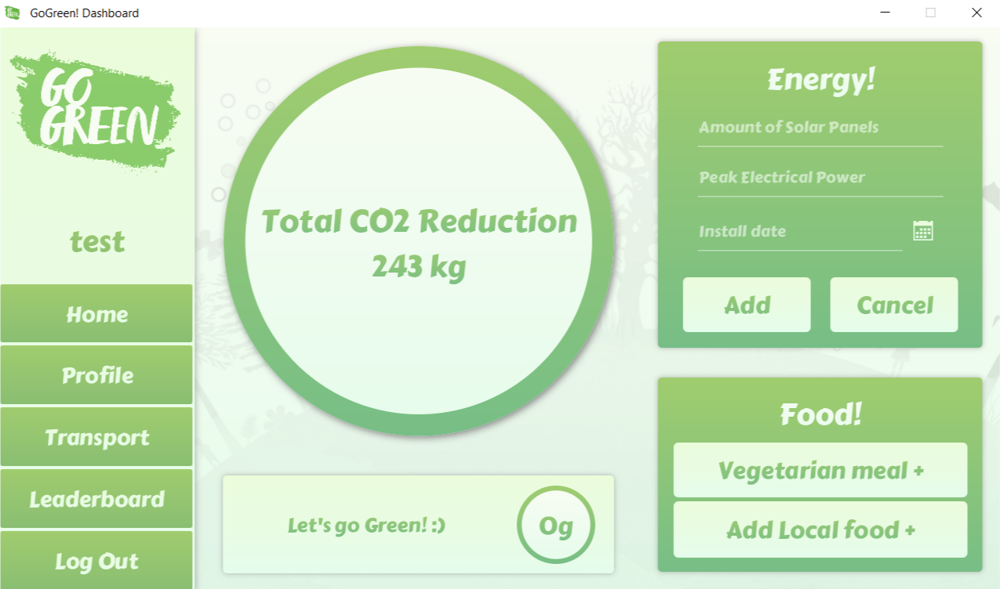
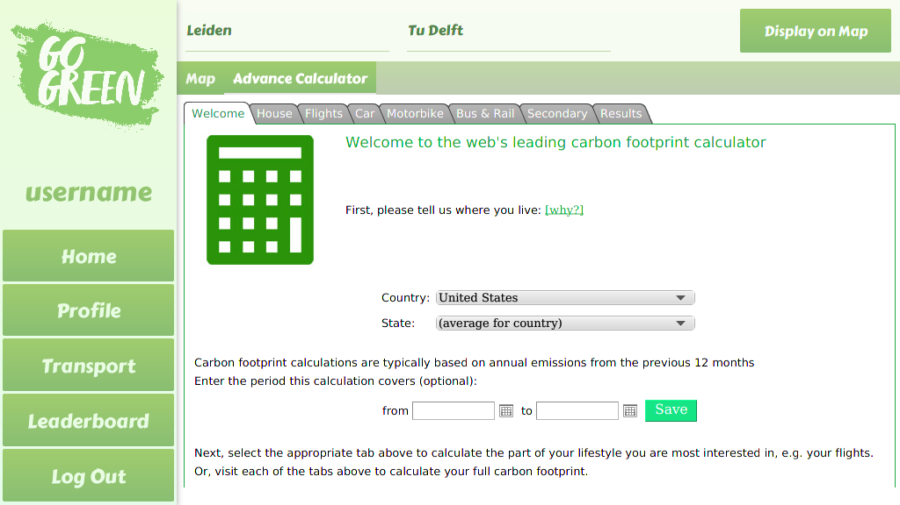
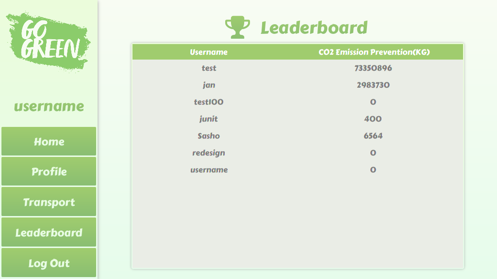
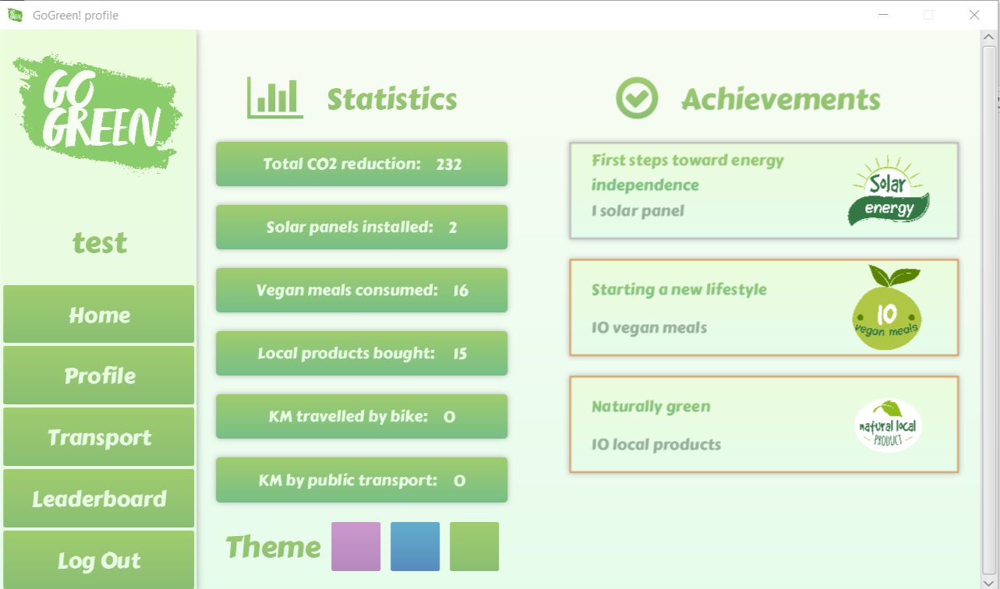

<h1 align="center">
    
</h1>

<b>GoGreen is a Java RESTful application to help you track and reduce your CO2 emissions with gamification aspects</b>

# About the project
This project was part of my university curriculum, originally with a group of 7 from which only 4 members remained
by the end of the course. Objective of the course was to build a software application helping people live a
more sustainable lifestyle. Students were thrown in the deep and had to develop the app completely
by themselves from scratch with weekly progress reviews with teaching assistants.  
The course/project concluded with a final presentation and received a 10/10 grade.   
The presentation, calculations for the CO2 emissions per activity and grading rubric can also be found in the repository.

## Tools used for the project
Tools: Agile and Scrum methodologies, Checkstyle and Jacoco  
Technologies: JavaFX, Gluon Scenebuilder, Java Springboot, Hibernate, MySQL, jUnit, Mockito, Maven,
Continuous Integration, Git with Gitlab, JFoenix Material Design

## Responsibilities
I have been mainly responsible for building the backend with the Java Springboot framework, 
setting up the project structure, login-signup screens and the functionality of 2 activities.
I have also fulfilled the project manager role by creating weekly documentation,
managing the scrumboard and setting the goals for the weekly sprints during the 10 week course.
Currently there are 6 activity recommendations to help users reduce their emissions.   

## Running the application
To run the application clone down the repository and simply run the GoGreen App Executable.jar file. You need to have the Java Runtime Environment(JRE) installed on your computer in order to run the app. (https://www.oracle.com/technetwork/java/javase/downloads/index.html)

## App Tour
#### Login

#### Sign up

### Homescreen

The circle in the middle shows the total CO2 reduction.
The notification box at the bottom shows how much co2 has been saved by the last action. 

When you add a solar panel, additional details can be provided.

### Transport

If you commit to Bike or PT (Public Transport), this will also put a google maps link on your clipboard with the route.
So you can immediately see what route is suggested in you browser. 
This feature is no longer functional as it requires a paid Google API which was provided by one of the team members for the duration of the project.

The Transportation tab also contains and integrated calculator from https://calculator.carbonfootprint.com/calculator.aspx,
which can be used to calculate the impact of various activities with great detail.

### Leaderboard

### Profile

There are 12 different achievements, each with varying degree of difficulty which can be viewed under the profile section.
The user can also switch the color theme of the app according to their liking and see profile statistics.

