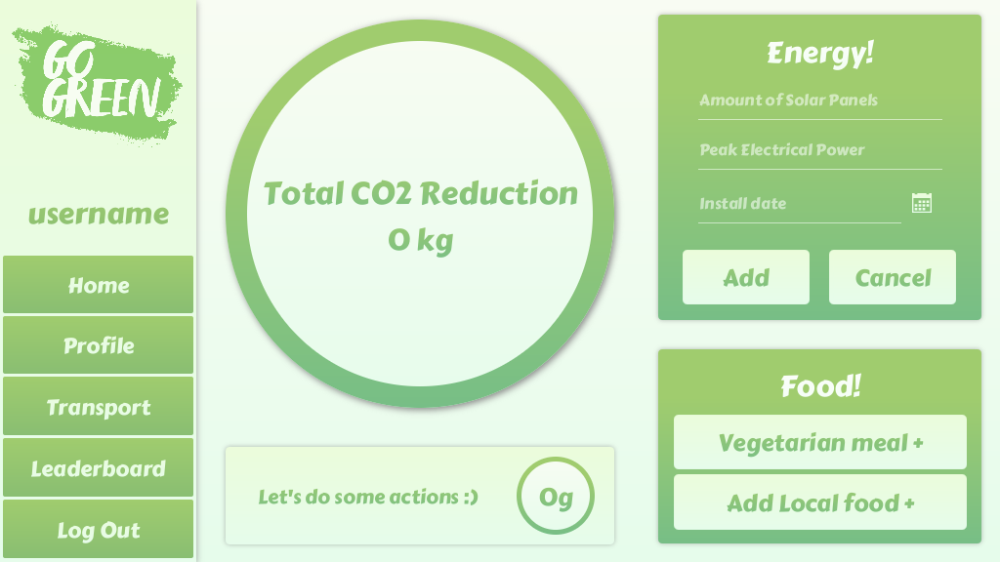

<h1 align="center">
    
</h1>

<b>GoGreen is an app to help you track and reduce your co2 emissions with gamification aspects</b>

##About the project
This project was part of my university curriculum which has been completed in a group of 4 with agile and SCRUM methodologies.
I have been mainly responsible for setting up the database, the project structure, building the backend, login and signup screen
and also fulfilled the project manager role by creating weekly documentation,
managing the scrumboard and setting the goals for the weekly sprints during the 10 week course.

##How to run the application
To run the application clone down the repository and simply run the GoGreen.jar file. You need to have the Java Runtime Environment(JRE) installed on your computer in order to run the app. (https://www.oracle.com/technetwork/java/javase/downloads/index.html)

##Using the GoGreen App
#### Login

#### Sign up

### Homescreen

The circle in the middle shows the total CO2 reduction.
The notification box at the bottom shows how much co2 has been saved by the last action.

When you add a solar panel, additional details can be provided.

### Transport

If you commit to Bike or PT (Public Transport), this will also put a google maps link in you clipboard with the route.
So you can immediately see what route is suggested in you browser. 
This feature is no longer functional as it requires a paid Google API which was provided by one of the team members for the duration of the project.

### Leaderboard

### Profile

There are in total 12 different achievement, each with a varying degree of difficulty.

